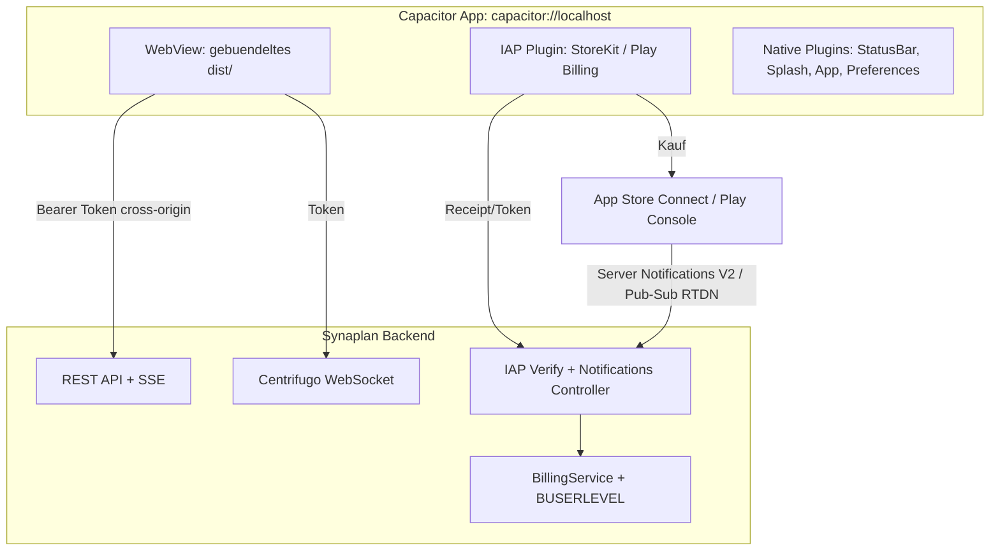
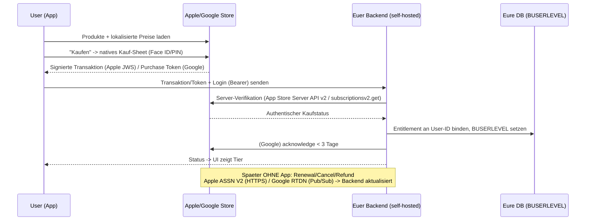

# Synaplan Mobile App mit Capacitor 8

## Ziel & Rahmen

Die bestehende Vue-3-SPA (`frontend/`) wird per **Capacitor 8** in eine native iOS- und Android-App verpackt. Es wird **keine neue UI** gebaut: das gebaute `frontend/dist/` wird in die App gebündelt, API-Calls gehen cross-origin zum bestehenden Backend. Der Capacitor-/Store-/IAP-Teil lebt in einem **eigenen privaten Repo** (`synaplan-apps`), da App-Identität, Signing-Secrets und Store-Konten anbieterspezifisch und für Open-Source-Self-Hoster irrelevant sind. Käufe laufen über **native IAP** (Apple StoreKit / Google Play Billing) mit **self-hosted Server-Validierung**, angebunden an das bestehende `BillingService` / `BUSERLEVEL`-System. Tests werden von einer anderen Person gemacht (Abschnitt „Test-Hinweise").

Entscheidungen (bestätigt): gebündeltes `dist/` · native IAP weltweit · self-hosted Validierung · **eigenes privates Repo `synaplan-apps` (Frontend via Git-Submodule)** · Cross-Plattform-Abos: **aktives Abo einer Quelle blockt Kauf über andere** · **alle Tiers per IAP kaufbar** (B2B-Rechnung über IAP nicht möglich = akzeptiertes Risiko) · **kein Push in v1** · **OTA/Live-Updates von Anfang an (Capgo)** · Dev-Accounts noch zu klären.

### Repo-Aufteilung

- `**synaplan-apps` (privat, NEU)**: `capacitor.config.ts`, native `ios/`- und `android/`-Projekte, IAP-Frontend-Glue, `build.sh`, Signing/Store-Configs, App-Assets. Bindet das öffentliche `synaplan`-Repo als **Git-Submodule** (auf einen **Release-Tag/SHA** gepinnt) ein und baut daraus `dist/`.
- `**synaplan` (öffentlich, bestehend)**: unvermeidbare produktseitige Anpassungen bleiben hier, weil sie Server-/SPA-Logik sind — Bearer-Token-Auth-Pfad, CORS, IAP-Validierungs-Controller, sowie die Native-Weichen in `httpClient`/`config`/Subscription-UI via `Capacitor.isNativePlatform()`. Diese Änderungen sind no-ops, solange die App nicht läuft, und stören Self-Hoster nicht.

**Submodule statt CI-Artefakt** (bewusste Wahl): Pinning auf Tags macht die Frontend↔App-Version reproduzierbar, lokaler Build braucht nur Node 22 (`git clone --recursive` → `./build.sh`), keine zusätzliche Artefakt-Pipeline. Die spätere Signing-CI nutzt denselben Submodule-Flow.

## Voraussetzungen (Capacitor 8)

- Node 22+, Xcode 26+ (macOS, für iOS-Build zwingend), Android Studio 2025.2.1+ / Android SDK API 24+
- iOS 15+ und Android 7 (API 24)+ werden unterstützt; WKWebView / System WebView
- **Pflicht 2026**: Android **Target API Level 35 (Android 15)** für neue Apps/Updates (Capacitor 8 erfüllt das, verifizieren); Google Play Billing Library **v7+/v8**; Apple `**PrivacyInfo.xcprivacy`** strikt erzwungen
- Apple Developer Program ($99/Jahr) + Google Play Console ($25 einmalig) — **müssen geklärt/eingerichtet werden** (Status aktuell unbekannt)

## Architektur-Überblick

## Phase 0 — Privates Repo `synaplan-apps` + Submodule

- Neues privates Repo `synaplan-apps` mit `package.json`.
- Öffentliches `synaplan`-Repo als **Git-Submodule** (z.B. unter `./synaplan`), gepinnt auf einen **Release-Tag/SHA**.
- `build.sh`: `git submodule update --init`, dann `cd synaplan/frontend && npm ci && npm run build`, anschließend `npx cap sync`.
- `capacitor.config.ts` mit `webDir: 'synaplan/frontend/dist'`.
- `.gitignore` für native Build-Artefakte (`ios/Pods`, `android/.gradle`, Builds) **und** Secrets (Signing, Service-Account-Keys).
- Update-Workflow dokumentieren: `git submodule update --remote` nur auf getaggte Releases.

## Phase 1 — Capacitor-Grundgerüst

- Dependencies (im Mobile-Repo): `@capacitor/core`, `@capacitor/cli`, `@capacitor/ios`, `@capacitor/android`.
- `capacitor.config.ts` mit eindeutiger `appId` (z.B. `com.synaplan.app`) und `appName`.
- `npx cap add ios` / `npx cap add android` → erzeugt `ios/` und `android/` im Mobile-Repo.
- Build-Flow: `./build.sh` (baut Frontend aus Submodule → `dist/`) → `npx cap sync`. Npm-Scripts `cap:sync`, `cap:ios`, `cap:android`.
- Native Essentials: `@capacitor/status-bar`, `@capacitor/splash-screen`, `@capacitor/keyboard`, `@capacitor/app` (Android-Back-Button + Deep Links), Icons/Splash via `@capacitor/assets`. Safe-Area-Insets sind in `style-v2.css` (Submodule) bereits vorhanden.

## Phase 2 — Runtime-Config & Cross-Origin (das Kernproblem)

Im nativen WebView ist der Origin `capacitor://localhost` (iOS) bzw. `https://localhost` (Android) — alle bisherigen Same-Origin-Annahmen brechen.

- **Native erkennen** und API-/WS-Basis-URL setzen, BEVOR `config.init()` läuft (in `[frontend/src/main.ts](frontend/src/main.ts)`): `Capacitor.isNativePlatform()` → `setApiBaseUrl('https://app.synaplan.com')` (existiert bereits in `[frontend/src/services/api/httpClient.ts](frontend/src/services/api/httpClient.ts)`).
- `**appBaseUrl` überschreiben** für native (heute `window.location.origin` in `[frontend/src/stores/config.ts](frontend/src/stores/config.ts)`) — sonst brechen OAuth-Redirects und Share-Links.
- **WebSocket-URL** aus Backend-Runtime-Config statt `window.location.host` beziehen (`RealtimeClient.ts`).
- **CORS** im Backend für den App-Origin freigeben.

### Auth: Bearer-Token-Pfad nur für native App (empfohlen)

Cookies cross-origin im WebView sind durch Third-Party-Cookie-Blocking fragil, und **SSE-Streaming** (Chat, `EventSource`) + WebSockets lassen sich nicht sauber über Capacitors `CapacitorHttp` leiten. Daher:

- Backend: neuer Login-Pfad gibt der App ein **Bearer-Token** zurück (vorhandene `BTOKENS`-Tabelle wiederverwenden). API akzeptiert `Authorization: Bearer …` zusätzlich zu Cookies.
- App: Token in **sicherem nativem Storage** (`@capacitor/preferences` bzw. Secure-Storage-Plugin) — bewusst NICHT `localStorage` (AGENTS-Regel betrifft Web-Tokens; native Secure-Storage ist anderes Threat-Model).
- `httpClient` hängt im Native-Modus den Bearer-Header an; SSE bekommt Token per Query-Param; WS nutzt bereits Token-Auth (`tokenApi`).
- **Frühen Spike machen**, um Cookie-Variante vs. Bearer final zu verifizieren — das ist das größte technische Risiko.

### OAuth / Social Login

- **OAuth NICHT im Haupt-WebView**: externe Login-Seiten dort zu laden zerstört den App-Kontext und ist Reject-Risiko. `allowNavigation`/`server.url` sind laut Capacitor **nicht für Produktion** gedacht.
- Stattdessen **System-Browser**: `ASWebAuthenticationSession` (iOS) / Chrome Custom Tabs (Android) via `@capacitor/browser` bzw. natives Social-Login-Plugin, mit **Authorization Code Flow + PKCE**.
- Rückkehr in die App über **Universal Links (iOS) / App Links (Android)** + `@capacitor/app` `appUrlOpen` (keine angreifbaren Custom-Schemes). Betrifft `SocialLogin.vue` und Backend-Redirect-URIs.
- **WICHTIG fürs Testen**: WKWebView ist im **Distribution/Release-Build strenger** als im Debug (Sessions brechen z.B. nach Backgrounding) → Auth zwingend in Release-/TestFlight-Builds verifizieren; ggf. `iosScheme: "https"` setzen.

## Phase 3 — Native In-App-Käufe (self-hosted)

Apple **und** Google werten AI-Abos als digitale Güter → **IAP-Pflicht** (15–30 % Provision, weltweit). Der bestehende **Stripe-Hosted-Checkout-Redirect** (`[SubscriptionView.vue](frontend/src/views/SubscriptionView.vue)` → `window.location.href`) ist in der App **nicht erlaubt** und muss durch IAP ersetzt werden.

### Frontend

- IAP-Plugin (Self-hosted): `cordova-plugin-purchase` (CdvPurchase) ist der ausgereifteste Capacitor-kompatible Weg für beide Stores mit eigenen Validierungs-Hooks (Dependency-Freigabe nötig). **Plugin-Version muss Google Play Billing Library v7+ (besser v8) nutzen** — sonst Update-Reject (Pflicht seit 31.08.2026).
- Plattform-Weiche in der Subscription-UI: im Native-Modus IAP-Kauf statt Stripe-Redirect; Stripe-spezifische Elemente ausblenden.
- Pflicht-Elemente für Store-Review: **„Käufe wiederherstellen"**-Button (Apple zwingend), Preis/Laufzeit-Anzeige aus Store-Produktdaten, **kein** Hinweis auf externe/Web-Zahlung für digitale Güter in der App.

### Backend (neue, self-hosted Validierung)

- Neuer `MobilePurchaseController` + Service: nimmt Kauf-Receipt/Token der App entgegen, validiert serverseitig, setzt `BUSERLEVEL` + `BPAYMENTDETAILS` analog zur Stripe-Logik in `[StripeWebhookController.php](backend/src/Controller/StripeWebhookController.php)`. **Entitlement nie aus dem Client-Success-Callback** ableiten — Server ist Single Source of Truth, **an User-ID gebunden** (nie nur ans Gerät).
- **Apple**: App Store Server API **v2** (JWT-signiert; `verifyReceipt` ist **deprecated**) zur Verifikation der **JWS-Transaktion** (StoreKit 2) + **App Store Server Notifications V2**-Endpoint für Verlängerungen/Kündigungen. **App Store Server Library / SignedDataVerifier** für Zertifikatsketten-Prüfung, Certs nicht hardcoden. PHP-Lib-Kandidat: `readdle/app-store-server-library-php`.
- **Google**: Google Play Developer API (`purchases.subscriptionsv2.get`) via `google/apiclient` + **Real-time Developer Notifications** über Pub/Sub-Push-Endpoint. **Kauf binnen 3 Tagen serverseitig `acknowledge`-n** (nach Entitlement-Vergabe), sonst Auto-Refund. **PENDING-Käufe nicht** freischalten (erst bei RTDN). **Play Integrity API** zur Absicherung, dass Requests vom echten App-Binary stammen.
- **Performance/Quota**: NICHT bei jedem App-Start beim Store verifizieren — lokale DB ist Arbeitskopie, Sync nur via RTDN/ASSN + bei Neukauf.
- **Produkt-Mapping**: Store-Produkt-IDs (PRO/TEAM/BUSINESS, ggf. monatlich/jährlich) → bestehende Tiers. Store-Preispunkte ~ 19,95 / 49,95 / 99,95 EUR; Apple/Google übernehmen Währung & Steuer.
- `BillingService` so erweitern, dass eine Subscription die Quelle (`stripe` vs `apple` vs `google`) kennt — Downgrade/Status-Sync je Quelle getrennt.
- **Transaktion → User binden** (Replay-Schutz): eine Receipt/Transaction darf nur dem eingeloggten User Entitlement geben, nie mehrfach verteilt werden; Sandbox- vs. Prod-Umgebung serverseitig erkennen.
- **Refund/Grace/Hold**: Notifications für Refund, Grace Period, Billing Retry, Account Hold verarbeiten → Entitlement entziehen/halten.
- Store-Produkte in App Store Connect & Play Console anlegen (manueller Account-Schritt).

### Cross-Plattform-Reconciliation (Entscheidung: block-cross)

- Hat ein User bereits ein **aktives Abo einer Quelle** (z.B. Stripe-Web), wird der Kauf über eine andere Quelle in der App **blockiert**; die UI verweist zum Verwalten an die jeweilige Plattform.
- Apple/Google-Abos lassen sich **nicht** über das Stripe-Customer-Portal kündigen → App verlinkt in die **System-Abo-Einstellungen** (iOS/Android).
- `BPAYMENTDETAILS` hält Quelle + Store-IDs konsistent; klare Priorität bei widersprüchlichen Zuständen.

### Provisions- & Steuer-Hinweis

- Standard 15 % (erste $1M/Jahr bzw. Abo ab Jahr 2 bei Google) bis 30 %. External-Link-Programme (geringere Gebühr) wurden bewusst NICHT gewählt (regional begrenzt, höheres Review-Risiko). Die Preisgestaltung sollte die Provision einkalkulieren.
- **Merchant of Record**: bei IAP sind Apple/Google MoR und führen die USt. ab — euer Stripe-Tax/Invoicing greift hier NICHT; Buchhaltung/Reporting separat denken.
- **Anti-Steering**: In der App darf NICHT auf günstigere Web-Preise hingewiesen werden.

## Zahlungsablauf, Hosting-Aufteilung & Steuern

**Hinweis:** Steueraussagen sind übliche Praxis, von der Steuerberatung final zu bestätigen.

### Ablauf einer In-App-Zahlung

Die Geldbewegung (Kartendaten, Abbuchung, Verlängerung, Mahnwesen, Refunds) liegt **vollständig bei Apple/Google**; ihr erhaltet nur einen signierten Kaufnachweis und übersetzt ihn serverseitig in ein Abo-Recht.

### Hosting-Aufteilung

- **Apple/Google:** Kauf-UI, Zahlungsabwicklung, wiederkehrende Abbuchung, Grace Period, Kündigung, Refunds, Verbraucher-Quittungen, Währung, **Einzug & Abführung der Verbraucher-USt.**
- **Selbst (im `synaplan`-Backend):** `MobilePurchaseController` + Validierung, **ASSN-V2-Endpoint** (Apple), **RTDN-Endpoint via Google Cloud Pub/Sub** (Google), Entitlement-DB, Produkt-Mapping, Reconciliation, `acknowledge`. **Neue Infra:** Google-Cloud-Projekt mit Pub/Sub-Topic; Secrets (Apple-Private-Key, Google-Service-Account-Key).

### Steuern — für uns als Firma

- **Web (Stripe):** ihr = Merchant of Record → ihr schuldet/führt USt. ab (Stripe Tax/OSS), Bruttoauszahlung minus ~1,5–3 %.
- **App (IAP):** Apple/Google = Merchant of Record → ziehen Verbraucher-USt. ein & führen sie ab, behalten **15–30 % Provision**, zahlen **netto** aus. Ihr verbucht das als Erlös und zahlt darauf Körperschaft-/Gewerbesteuer.
- **Buchhaltung:** dieselbe Tier kann aus 3 Kanälen kommen (Stripe/Apple/Google) → Erlöse **sauber je Kanal trennen**, eigene Reports/Währungen.

### Steuern — für kaufende Firmen (B2B) — akzeptiertes Risiko

- Entscheidung: **alle Tiers (PRO/TEAM/BUSINESS) per IAP kaufbar.**
- **Haken:** IAP stellt nur einfache Verbraucher-Quittungen aus, **keine B2B-Rechnung mit ausgewiesener USt. + Käufer-USt-ID** → **Vorsteuerabzug/Reverse-Charge für Firmenkäufer praktisch nicht möglich**.
- Firmenkunden, die eine ordentliche Rechnung brauchen, sollten weiterhin über **Web/Stripe** kaufen. In der App **Anti-Steering** beachten (informieren erlaubt, aktives Bewerben günstigerer Web-Preise nicht).

## Phase 4 — Native Geräte-Features & App-Lifecycle

Eure SPA nutzt Funktionen, die im WebView native Brücken/Permissions brauchen:

- **Datei-Upload** (RAG-Dokumente, Bilder): `@capacitor/camera`, Foto-/Datei-Picker + Permissions; Upload cross-origin mit Bearer.
- **Mikrofon** (Voice/whisper.cpp): Mic-Permission, ggf. natives Audio.
- **Datei-Download/-Vorschau** (generierte Bilder, PDFs): `@capacitor/share`, Filesystem.
- Jede Permission braucht **Begründungstexte** (iOS Info.plist `NSCameraUsageDescription`/`NSMicrophoneUsageDescription`, Android Manifest) — sonst Crash/Reject.
- **Secure Storage**: Auth-Token in iOS **Keychain** / Android **Keystore/EncryptedSharedPreferences** (Secure-Storage-Plugin), NICHT `@capacitor/preferences` (unverschlüsselt). Optional Biometrie-Lock.
- **App-Lifecycle**: bei Resume aus dem Hintergrund WebSocket/Centrifugo reconnecten, Session-Gültigkeit prüfen, abgebrochene SSE-Streams behandeln; Token-Refresh + Rotation im Langzeitbetrieb.
- **Netzwerk/Offline**: `@capacitor/network`, sinnvolle Offline-UI (aktueller Service Worker cached nichts).
- **reCAPTCHA & CSP**: reCAPTCHA (Login/Register, Runtime-Config) kann im `capacitor://`-Origin brechen → Domain-Allowlist/nativer Pfad; Content-Security-Policy in `index.html` für das `capacitor://`-Schema anpassen (sonst weiße Seite); WKWebView-Config (Cleartext fürs lokale Testen, `allowsInlineMediaPlayback`).
- **Guest-Mode & Locale**: entscheiden, ob Guest-Sessions in der App sinnvoll sind; Device-Locale auf de/en/es/tr mappen.

## Phase 5 — OTA / Live-Updates (Capgo)

OTA von Anfang an (Web-Assets ohne Store-Review aktualisieren):

- Capgo-Plugin + Update-Server/Account; Versionierung der Web-Bundles, Signaturprüfung, Rollback-Strategie.
- **Nur konforme** Änderungen per OTA (UI/Logik-Fixes) — KEINE Änderung an Verhalten/Zahlungslogik (Store-Bann-Risiko, Apple 3.2.2 / Google).
- OTA-Versionsstand mit App-/Backend-Version abstimmen (siehe Forced-Update).

## Phase 6 — Versionierung & Forced Update

Native Apps laufen bei Usern lange in alten Versionen — die Web-App nicht.

- Backend-API **rückwärtskompatibel** halten oder **Min-Version-Gate**: Runtime-Config liefert Mindest-App-Version; zu alte App zeigt „bitte aktualisieren".
- Kompatibilitäts-Matrix dokumentieren: App-Version ↔ gepinnte Frontend-Submodule-Version ↔ Backend-API-Vertrag (zusammen mit OTA-Stand).

## Phase 7 — Store-Compliance & UX-Feinschliff

- **Account-Löschung in-App** (Apple & Google zwingend, wenn Account anlegbar) — bei Google zusätzlich **Web-Link** zur Löschung.
- **Apple Privacy Manifest `PrivacyInfo.xcprivacy`** (2026 strikt beim Upload erzwungen): Required-Reason-APIs deklarieren; **jedes Third-Party-SDK** (Capacitor-Plugins, Capgo, Sentry, IAP-Plugin) braucht eigenes Manifest + Signatur.
- **Privacy-Policy- UND Terms-of-Use-Links** in App-Store-Connect-Metadaten **und** in der App (z.B. Settings) erreichbar.
- Datenschutz-/Privacy-Labels müssen zur tatsächlichen Datennutzung passen (App Store Privacy Nutrition Label, Play Data Safety); Berechtigungs-Begründungen (Kamera/Mikrofon/Dateien).
- **Subscription-Metadaten**: Preise/Trial-Bedingungen lesbar und konsistent mit App Store Connect.
- **Guideline 4.2 (Minimum Functionality)** entschärfen: native Mehrwerte (Splash, Status-Bar-Theming, Offline-Handling, native Navigation/Back, Kamera/Datei/Teilen) — eine reine Webseiten-Hülle wird abgelehnt; Reviewer muss in ~30s sehen, „warum das eine App ist".
- Android-Back-Button, Keyboard-Verhalten (vorhandenes `useKeyboardOpen.ts` prüfen), Dark-Mode-Statusbar.

## Phase 8 — Build, Release-Engineering & Auslieferung

- Lokal: iOS-Build nur auf macOS/Xcode, Android via Android Studio/Gradle. `npx cap run ios|android`.
- **Versionierung** (`CFBundleVersion`/`versionCode`) automatisiert hochzählen; getrennte Bundle-IDs für dev/staging/prod + Environment-Switch (`setApiBaseUrl`).
- **Signing-Management** (z.B. fastlane), CI-Secrets sicher verwalten, **Crash-Reporting** (z.B. Sentry) für native Crashes.
- **Store-Assets**: Screenshots + Beschreibungen in 4 Sprachen (de/en/es/tr), Alterseinstufung, Support-/Datenschutz-URL.
- CI/Signing (Apple-Zertifikate, Android-Keystore), TestFlight / Play Internal Testing für Beta — Docker-/CI-Configs nur nach Rücksprache (AGENTS).

## Test-Hinweise (für die andere Person, nur Infos)

- **Web/Unit unverändert**: Vitest (Frontend) + PHPUnit (Backend) laufen weiter wie gehabt; neue Backend-IAP-Validierungs-Services brauchen Unit-Tests mit gemockten Store-APIs (kein echter Store-Call in Tests).
- **IAP-E2E**: Apple **Sandbox-Tester** (App Store Connect) und Google **License-Testing**-Accounts (Play Console) nötig; echte Käufe in Sandbox, keine echten Belastungen.
- **Geräte-Matrix**: iOS-Simulator deckt IAP nur eingeschränkt ab → echtes Gerät empfohlen; Android-Emulator API 24+ mit aktueller System-WebView.
- **Auth-Spike testen**: Login + Chat-SSE-Streaming + WebSocket-Realtime im nativen WebView (Bearer-Pfad) — der kritischste Regressionspfad.
- **Server-Notifications**: Apple ASSN V2 und Google Pub/Sub RTDN mit den Test-Payloads der Stores gegen den Webhook-Endpoint prüfen (Renewal, Cancel, Refund, Grace Period).
- **Cross-Plattform-Konflikt**: User mit aktivem Stripe-Web-Abo testen → IAP-Kauf in der App muss blockiert werden.
- **OTA**: Bundle-Update ausrollen, App-Neustart zieht neue Web-Version; Rollback testen.
- **Forced-Update**: Min-Version-Gate mit künstlich alter App-Version verifizieren.
- **Geräte-Features**: Kamera/Datei-Upload, Mikrofon, Download/Teilen, Permission-Ablehnung, Offline/Reconnect aus Hintergrund.
- **Release-/Distribution-Builds testen** (nicht nur Xcode-Debug): WKWebView ist in Produktion strenger — v.a. Login-Session nach Backgrounding/Reopen über TestFlight prüfen.
- **Google `acknowledge`-Flow**: Kauf nicht acknowledgen → prüfen, dass Auto-Refund greift; PENDING-Kauf simulieren.
- **Upload-Gate**: Build mit fehlendem/fehlerhaftem `PrivacyInfo.xcprivacy` wird beim Upload abgelehnt — vorab verifizieren.
- Bestehende Pre-Commit-Gate-Regeln (lint, phpstan, test, type-check) gelten für alle Backend-/Frontend-Änderungen.

## Bewusst auf v2/später verschoben

- **Push-Benachrichtigungen** (FCM + APNs, Device-Token-Registry, Notification-Routing) — Architektur offenhalten, nicht verbauen.
- Biometrie-Lock, erweitertes Offline-Caching, jährliche IAP-Produkte (falls nicht direkt benötigt).

## Offene Punkte / vor Start zu klären

- Dev-Accounts (Apple + Google) anlegen — Status aktuell unbekannt.
- Git-Host/Org für das private `synaplan-apps`-Repo festlegen; Submodule-Zugriff (HTTPS-Token vs. SSH-Deploy-Key) für lokale Builds und spätere CI.
- Finale Produktion-Domain für API/WS (`setApiBaseUrl`-Wert).
- Genauer App-Name + Bundle-/App-ID + App-Icon/Splash-Assets.
- Jährliche IAP-Produkte zusätzlich zu monatlich? (heute hat Stripe nur monatlich aktiv).
- Google-Cloud-Projekt + Pub/Sub-Topic für RTDN bereitstellen; Apple-Private-Key & Google-Service-Account-Key sicher verwalten.
- Steuerberatung: kanalgetrennte Erlösverbuchung (Stripe/Apple/Google) + B2B-Rechnungsthema final klären.

