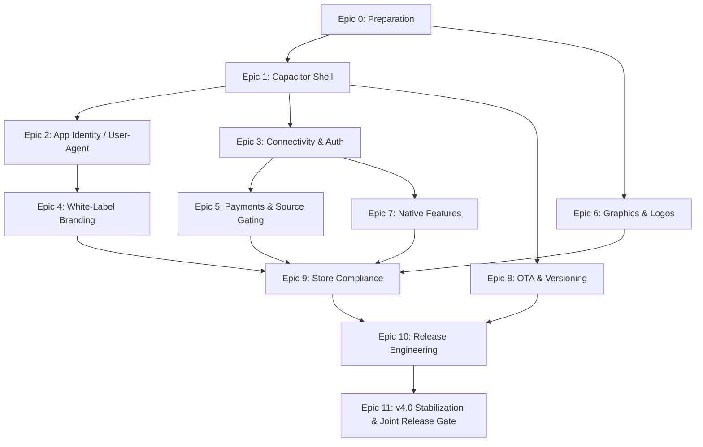

# Synaplan Mobile App — Master Plan (INDEX)

> **This is the index.** Each epic below is a self-contained "vibing sprint" in its own
> `planning_<n>_*.md` file: goal, scope, the exact files to touch (with paths), acceptance
> criteria, test notes, and risks. Work them roughly in order — dependencies are listed in
> each doc's front-matter (`depends_on`).
>
> Language note: these planning docs are in **English** (open-source / self-hoster audience).
> The original German `Planning.md` content is superseded by — and fully carried into — the
> epic docs below.

## Mission (the v4.0 framing)

Synaplan **v4.0** has two goals that ship together:

1. **A pretty bug-free platform** — a deliberate stabilization pass (Epic 11).
2. **A mobile app** for **iOS and Android**, offered **"flexible" and Open Source**.

The app itself is intentionally **minimal**: we wrap the existing Vue 3 SPA
(`synaplan/frontend/dist/`) with **Capacitor 8** — **no new UI**. The real work is four
cross-cutting "publishing problems" that an open-source, store-distributed app forces on the
**platform** side. Those are the four **Aspects** below.

### New in this revision (the product story)

The app is a **configurable, server-branded client** — "your AI, your server, your brand":

1. **Configurable server, with a default.** The app **ships with `https://web.synaplan.com`** as the
   default server, but the user can **edit, validate, save, and reset** the server URL in-app. All
   connectivity, auth, and branding resolve against the currently configured server.
   (→ [Epic 3](planning/planning_3_connectivity_auth.md), §3.0.)
2. **Stored identity, per server.** Once signed in to the configured server, the app **stores the
   identity** (Bearer token + user) in encrypted native storage, **keyed per server** — switching
   servers switches identity cleanly, with no token leakage across servers.
   (→ [Epic 3](planning/planning_3_connectivity_auth.md).)
3. **Server-emitted branding the Admin controls.** The `synaplan` server **emits its brand —
   name, color(s), fonts, logo, and start page** — all **easily editable by the server Admin** in
   System Config. The **core open-source web product is brandable too**, not just the app; the app
   re-fetches the brand whenever its configured server changes.
   (→ [Epic 4](planning/planning_4_branding_whitelabel.md).)

Two **cross-cutting guardrails** keep this honest:

- **Everything is testable before merge** — five gates: **lint, click, parse, format, and an AI
  logic review in Cursor**. (→ [Epic 12](planning/planning_12_quality_gates.md).)
- **The public `synaplan` repo changes are explicitly encapsulated** to minimize blast radius:
  small, guarded, default-off, and listed in a single registry.
  (→ [Epic 13](planning/planning_13_synaplan_encapsulation.md).)

## The four Aspects (hard requirements) → where they live

| # | Aspect (requirement) | Owning epic |
|---|----------------------|-------------|
| 1 | **App client must call the platform with a `Synaplan Mobile Vx.x` User-Agent.** | [Epic 2](planning/planning_2_app_identity_useragent.md) |
| 2 | **The platform must emit its branding — name, color(s), fonts, logo, start page — Admin-editable; open-source hosters can show e.g. "Synaplan powered by Cristian". Core OSS product brandable too.** | [Epic 4](planning/planning_4_branding_whitelabel.md) |
| 3 | **Payment is single-source-of-truth: a subscription is `ACTIVE` and owned by exactly one channel — web = Stripe, app = Apple/Google Pay (≈30% fee). Must be clearly configured & planned.** | [Epic 5](planning/planning_5_payments_subscription.md) |
| 4 | **Graphics and logos must be well sorted for the app release.** | [Epic 6](planning/planning_6_graphics_logos.md) |

> Reality check from the codebase: **none of these exist yet.** There is no custom User-Agent,
> no white-label config (everything is a hardcoded `Synaplan` + "Powered by synaplan"), the
> Stripe flow has **no subscription `source` field**, and the app icon PNGs aren't even committed
> (they're generated by a script). So each Aspect is a genuine epic, not a packaging detail.

## Repo split (unchanged, confirmed)

- **`synaplan-apps` (private, this repo):** `capacitor.config.ts`, native `ios/`+`android/`
  projects, IAP frontend glue, `build.sh`, signing/store configs, app assets. Pulls the public
  `synaplan` repo as a **Git submodule** pinned to a **release tag/SHA** and builds its `dist/`.
- **`synaplan` (public):** only the **unavoidable** product-side changes (Bearer auth path, CORS,
  branding config incl. fonts + start page, subscription `source`, IAP validation controller,
  native switches via `Capacitor.isNativePlatform()`). These are **no-ops while the app isn't
  running and nothing is configured**, so they don't disturb self-hosters. The **in-app server
  switcher, per-server identity, IAP UI glue, OTA, and native features live in `synaplan-apps`** —
  the submodule only *reads* the resolved server and *exposes* additive config.

> **Blast-radius contract:** every `synaplan` change is small, guarded, default-off, additive, and
> reversible, and the **complete set of touched files is listed in one registry** —
> [Epic 13](planning/planning_13_synaplan_encapsulation.md). If a submodule PR touches a file not in
> that registry, it's either added with a guard + justification, or the logic moves to
> `synaplan-apps`.

**Why submodule, not a CI artifact:** pinning to tags makes the frontend↔app version
reproducible; a local build only needs Node 22 (`git clone --recursive` → `./build.sh`).

## Roadmap / sprint order

Suggested grouping into delivery waves:

- **Wave A (foundations):** Epic 0 → 1 → 3. App boots, **lets you pick/save a server (default
  `web.synaplan.com`)**, talks to the backend, you can log in.
- **Wave B (the Aspects):** Epic 2, 4, 6 (largely parallel) + Epic 5 (the big one).
- **Wave C (hardening):** Epic 7, 8, 9.
- **Wave D (ship):** Epic 10, then Epic 11 as the single go/no-go gate.

**Guardrails wrap every wave:** Epic 12 (five testable merge gates) and Epic 13 (synaplan
encapsulation / blast-radius contract) are **not** sequential — they apply to **every** epic and
gate every merge in both repos.

## How to read a "vibing sprint" doc

Every `planning_<n>_*.md` has the same shape so an agent can pick it up cold:

- **Front-matter:** `epic`, `depends_on`, `repos`, `estimate`, `aspect` (if it owns one).
- **Goal / v4.0 context / Scope (in & out).**
- **Prerequisites.**
- **Tasks** — the vibe-coding checklist, with **exact file paths** from the current codebase.
- **Acceptance criteria (Definition of Done).**
- **Test notes** (for the separate QA person).
- **Risks & mitigations / Open questions.**

## Epic index

| Epic | File | Aspect | Est. |
|------|------|--------|------|
| 0 — Preparation & Foundations | [planning_0_preparation.md](planning/planning_0_preparation.md) | — | M |
| 1 — Capacitor Shell & Minimal Native App | [planning_1_capacitor_shell.md](planning/planning_1_capacitor_shell.md) | — | M |
| 2 — App Identity & `Synaplan Mobile Vx.x` User-Agent | [planning_2_app_identity_useragent.md](planning/planning_2_app_identity_useragent.md) | **1** | S |
| 3 — Cross-Origin Connectivity & Auth | [planning_3_connectivity_auth.md](planning/planning_3_connectivity_auth.md) | — | L |
| 4 — White-Label Branding & Attribution | [planning_4_branding_whitelabel.md](planning/planning_4_branding_whitelabel.md) | **2** | L |
| 5 — Payments & Subscription Source Gating | [planning_5_payments_subscription.md](planning/planning_5_payments_subscription.md) | **3** | XL |
| 6 — Graphics, Logos & Store Assets | [planning_6_graphics_logos.md](planning/planning_6_graphics_logos.md) | **4** | M |
| 7 — Native Device Features & Lifecycle | [planning_7_native_features.md](planning/planning_7_native_features.md) | — | M |
| 8 — OTA, Versioning & Forced Update | [planning_8_ota_versioning.md](planning/planning_8_ota_versioning.md) | — | M |
| 9 — Store Compliance & UX | [planning_9_store_compliance.md](planning/planning_9_store_compliance.md) | — | M |
| 10 — Release Engineering & Delivery | [planning_10_release_engineering.md](planning/planning_10_release_engineering.md) | — | L |
| 11 — v4.0 Platform Stabilization & Joint Release Gate | [planning_11_v4_stabilization.md](planning/planning_11_v4_stabilization.md) | — | L |

### Cross-cutting guardrails (apply to **every** epic — not sequential sprints)

| Guardrail | File | Applies to | Est. |
|-----------|------|------------|------|
| 12 — Quality Gates & Testable Merge Process | [planning_12_quality_gates.md](planning/planning_12_quality_gates.md) | all epics | M |
| 13 — Synaplan Encapsulation & Blast-Radius Contract | [planning_13_synaplan_encapsulation.md](planning/planning_13_synaplan_encapsulation.md) | every submodule change | M |

## Global Definition of Done (applies to every epic)

No epic is "done" until **both guardrails pass**:

- **Five gates green** (Epic 12): **lint** (ESLint/Prettier/`vue-tsc`/PHPStan/markdownlint),
  **click** (Playwright + component + native click-through), **parse** (Zod/config/UA/manifest
  validation), **format** (`--check` + i18n completeness), and an **AI logic review in Cursor**
  (default-safety, regression, store-policy, security) — run **unfiltered**, no `--no-verify`.
- **Encapsulation honored** (Epic 13): any `synaplan` change is in the registry, guarded,
  default-off, additive, reversible — and the **unconfigured web/self-host product is provably
  unchanged**.

## Marketing & positioning (basic ideas, tied to the tech)

The new capabilities above are the marketing story — each angle maps to a concrete enabler:

- **"Your AI. Your server. Your brand."** — the headline: configurable server (Epic 3) +
  server-emitted branding incl. fonts & start page (Epic 4).
- **One app for the SaaS *and* self-hosters.** Default `web.synaplan.com` out of the box; point it
  at your own Synaplan in seconds. Great for agencies/MSPs shipping a **branded AI app to clients
  without building an app**.
- **Brandable to the core** — not a skin on top: name, colors, fonts, logo, start page, attribution
  ("`<Brand>` · powered by Synaplan") all driven by the server, no rebuild. The **open-source web
  product is brandable too**.
- **Open source + in the stores.** Credibility of OSS with the convenience of App Store / Google
  Play; OTA fixes (Epic 8) keep it fresh.
- **Digital sovereignty / EU angle.** Self-host + own-brand + own-server fits the public-sector /
  privacy narrative (aligns with the `synaplan.eu` positioning).
- **Trust through transparency.** Tiny, listed, default-off platform changes (Epic 13) + a testable
  merge gate (Epic 12) — a story for security-conscious buyers.

> Keep these as *ideas to validate*, not commitments — pricing/anti-steering rules (Epic 5/9)
> constrain what the **in-app** copy may say (no steering to cheaper web prices).

## Confirmed decisions (carried from the original plan)

- Bundled `dist/` (no remote `server.url` in production).
- **Default server `https://web.synaplan.com`, user-editable + persisted in-app**; identity stored
  per configured server (Epic 3 §3.0).
- **Server-emitted, Admin-editable branding** (name, color, fonts, logo, start page); core OSS web
  product brandable too (Epic 4).
- **Every merge passes five gates** (lint/click/parse/format/AI logic review) and **respects the
  encapsulation contract** (Epics 12 + 13).
- Native IAP worldwide; **self-hosted** server-side validation.
- Private `synaplan-apps` repo; frontend via **Git submodule** pinned to a release tag.
- Cross-platform subscriptions: an active sub from one source **blocks** purchase via another.
- **All tiers** purchasable via IAP (B2B-invoice-via-IAP not possible = accepted risk).
- **No push notifications** in v1.
- **OTA / live updates from day one** (Capgo).
- Apple Developer ($99/yr) + Google Play ($25 once) accounts — **must be set up** (Epic 0).

## Open questions tracked across epics

- Default server is `https://web.synaplan.com` (decided); open: any allow-list on which custom
  servers a *store* build may connect to, and whether to wipe vs retain a previous server's
  identity on switch (Epic 3).
- Exact app name + bundle/app IDs + icon/splash source art (Epic 0 + 6).
- Yearly IAP products in addition to monthly? (Epic 5).
- Git host/org for the private repo + submodule access (HTTPS token vs SSH deploy key) (Epic 0).
- Google Cloud project + Pub/Sub topic for RTDN; Apple private key + Google service-account key (Epic 5).
- Tax advisor sign-off on channel-separated revenue (Stripe/Apple/Google) + B2B invoicing (Epic 5).
